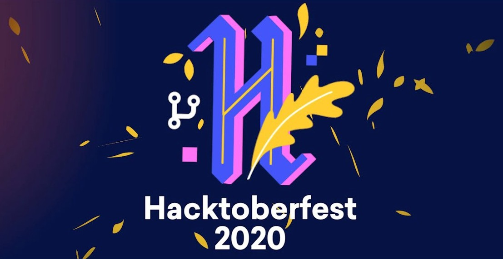

# HACKTOBERFEST 2020



##### Star The Repository if it helped you in any direction.

# Algorithms and Data-Structures.
This is a repository to get Algorithms and data-structures in many languages.

Everybody is welcomed to contribute to this repo.

# Overview
The goal of this project is to help the beginners with their contributions in Open Source. We aim to achieve this collaboratively, so feel free to contribute in any way you want, just make sure to follow the contribution guidelines.
You can contribute to it in either of the following ways:
You can choose atleast any one option below or can add any algorithm or data-structure you like:

- Beginners:
	- A simple algorithm you know in any language.
  - Add any easy comptitive programming question you like.
- Intermediate:
	- Add any algorithm you like.
  - Add any data-structure implementation.
  - Add any interview question as comment and solution in any language.
- Experienced:
  - Add any important algorithm in any language.
	- Add any game in your favorite programming language!
  - Add any Hard Problem from competitve programming website.
  - Add any interview question as comment and solution in any language.

## Implementations ⚙

[](https://github.com/SobhanBera/algorithms)      [](https://github.com/SobhanBera/algorithms)      [](https://github.com/SobhanBera/algorithms)      [](https://github.com/SobhanBera/algorithms)      [](https://github.com/SobhanBera/algorithms)      [](https://github.com/SobhanBera/algorithms)      [](https://github.com/SobhanBera/algorithms)


## Quick Start 🌟
- You must be assigned to an issue before this steps.
- Fork this repo.
- Clone the repo or type this commands.
  ```bash
  git clone https://github.com/<your_username_here>/algorithms.git
  cd design-blocks
  ```
- Start writing you code, when done with the code part type this commands.
  ```bash
  git add .
  git commit -m "<what_you_have_contributed>"
  git push
  ```
- Then make a PR to this repo and wait for the merge.
- That's it you have contributed to open source.
- If you enjoyed this you can do it again with another code.

## What is Hacktoberfest?

Hacktoberfest is a month long virtual festival event to celebrate open source contributions presented by Digital Ocean and DEV. It is the easiest way to get into open source!

During the entire month of October 2020, all you have to do is contribute to any open source projects and open at least 4 pull requests. Yes, any project and any kind of contributions.

<p align='center'>
  <a href="https://github.com/SobhanBera/algorithms">
    </a>
</p>

## Why Should I Contribute?

The Hacktoberfest’s simple plain objective is:
Support open source and earn a limited edition T-shirt!
But, it’s not just about the t-shirts or stickers. Its about supporting open source. Its about celebrating open source, and giving it back. If you’ve never contributed to open source before, this is the perfect time to get started because Hacktoberfest provides a large list of available contribution opportunities.

## What Can I Contribute?

Hacktoberfest® is open to everyone in our global community. Whether you’re a developer, student learning to code. You can contribute to anything from code to simple fix, new feature to grammar mistake.

## How to Contribute in this repo.

Contributing to open-source is easy.

- Please read the contributing guideline before any PR.
- Fork the repository
- Improve current program by
  - improving codes and features
  - adding new feature
  - add any algorithm you like
  - by adding any data-structure implementation yout like.
  - improving the documentation
  - you can also optimise somebody's code
- Push your work and Create a Pull Request

[Click here for more explanation](https://github.com/SobhanBera/algorithms/blob/main/docs/CONTRIBUTING.md)

## What if my pull requests aren’t accepted?

The only exception would be if the project maintainer chooses to mark your pull request as “invalid”. Even if your pull requests aren’t accepted, they should still count toward your 4 pull requests necessary to earn the shirt.

## What kinds of pull requests count toward earning the Hacktoberfest shirt?
Any pull request made to a public repo on GitHub will count. The pull request must contain commits you personally made yourself — not automated commits from bots.

You can contribute to any open source project hosted on Github.com and contribute anything between October 1 to October 31 midnight in 2020. You will find plenty of issues labeled with hacktoberfest or good-first-issue etc on Github. These will be the simple ones most probably and easy to fix.

### Directory Tree 👇🏻
<details>
<summary><strong>Directory Tree</strong></summary>

```
algorithms/
├── algorithms/
│   ├── c-sharp/
│   │   └── algorithmsInfo.md
│   ├── cpp/
│   │   ├── BinarySearch.cpp
│   │   ├── bogosort.cpp
│   │   ├── BubbleSort.cpp
│   │   ├── DFT.cpp
│   │   ├── HeapSort.cpp
│   │   ├── InsertionSort.cpp
│   │   ├── kadane's Algorithm.cpp
│   │   ├── Kruskal's Minimum Spanning Tree.cpp
│   │   ├── LongestIncreasingSubsequence.cpp
│   │   ├── LongestPalindromeSubstring.cpp
│   │   ├── MergeSort.cpp
│   │   ├── SelectionSort.cpp
│   │   └── algorithmsInfo.md
│   ├── java/
│   │   ├── BinarySearch.java
│   │   ├── BubbleSort.java
│   │   ├── DFS.java
│   │   ├── DijkstraAlgorithm.java
│   │   ├── InterpolationSort.java
│   │   └── algorithmsInfo.md
│   ├── javascript/
│   │   ├── BubbleSort.js
│   │   ├── LinearSearch.js
│   │   └── algorithmsInfo.md
│   ├── other/
|   |   ├── TypeScript/
|   │   │   └── BogoSort.ts
│   │   └── algorithmsInfo.md
│   └── python/
│       ├── BinarySearch.py
│       ├── BreadthFirstSearch.py
│       ├── BubbleSort.py
│       ├── LinearSearch.py
│       ├── MergeSort.py
│       └── algorithmsInfo.md
├── data structures/
│   ├── c-sharp/
|   |   └── dsInfo.md
│   ├── cpp/
|   |   ├── BST.cpp
|   |   ├── LinkedList.cpp
|   |   └── dsInfo.md
│   ├── java/
|   |   └── dsInfo.md
│   ├── javascript/
|   |   └── dsInfo.md
│   ├── other/
|   |   └── dsInfo.md
│   └── python/
|       └── dsInfo.md
├── others/
|   ├── PythonSMTP_Skeleton.py
|   └── SnakeGame.py
├── questions/
│   ├── c-sharp/
|   |   └── queInfo.md
│   ├── cpp/
|   |   ├── Edit Distance.cpp
|   |   ├── TwoSum.cpp
|   |   └── queInfo.md
│   ├── java/
|   |   └── queInfo.md
│   ├── javascript/
|   |   └── queInfo.md
│   ├── other/
|   |   └── queInfo.md
│   └── python/
|       └── queInfo.md
└── templates/
    ├── cpp/
    |   └── templateHelp.md
    ├── java/
    |   └── templateHelp.md
    ├── other/
    |   └── templateHelp.md
    ├── python/
    |   └── templateHelp.md
    └── templateHelp.md
```
</details>
<!-- ├── -->

</br>

## Implemented Algorithms

| Algorithm                       | CPP           | Java       | Python    | JavaScript | Golang  | C#     | Other    |
| :---                            | :---:         | :---:      | :---:     | :---:      | :---    | :---:  | :---:    | 
| Binary Search                   | ✔             | ✔         | ✔         |            |         |        |	        |
| Bogo Sort                       | ✔             |            |           |            |         |        | TS ✔     |
| Breadth First Search            |               |            | ✔         |            |         |        |          |
| Breadth First Traversal         |               |            |           |            |         |        |          |
| Bubble sort                     | ✔             | ✔          | ✔         | ✔         |         |        |	         |
| Counting Sort                   |               |            |           |            |         |        |	         |
| Depth First Search              |               | ✔          |           |            |         |        |	         |
| Depth First Traversal           | ✔             |            |           |            |         |        |	         |
| Dijkstra Algorithm              |               | ✔          |           |            |         |        |	         |
| Finite Automata                 |               |            |           |            |         |        |	         |
| Heap Sort                       | ✔              |            |           |            |         |        |	         |
| Huffman Coding                  |               |            |           |            |         |        |	         |
| Insertion Sort                  | ✔             |            |           |            |         |        |      	   |
| Interpolation Search            |               | ✔          |           |            |         |        |	         |
| K-NN                            |               |            |           |            |         |        |	         |
| K Centers Problem               |               |            |           |            |         |        |	         |
| Kadane's Algorithms             | ✔             |            |           |            |         |        |	         |
| KMP Algorithm                   |               |            |           |            |         |        |          |
| Kruskal’s Minimum Spanning Tree Algorithm |   ✔ |            |           |            |         |        |	         |
| Linear Search                   |               |            |✔          | ✔         |         |        |	         |
| Longest Common Subsequence      |               |            |           |            |         |        |	         |
| Longest Increasing Subsequence  |✔              |            |           |            |         |        |	         |
| Longest Palindromic Substring   |✔              |            |           |            |         |        |	         |
| Merge Sort                      |✔              |            | ✔         |            |         |        |      	   |
| Naive Search                    |               |            |           |            |         |        |	         |
| Quick Sort                      |               |            |           |            |         |        |	         |
| Radix Sort                      |               |            |           |            |         |        |	         |
| Selection Sort                  | ✔             |            |           |            |         |        |      	   |
| Sieve of Eratosthenes           |               |            |           |            |         |        |	         |
| Suffix Array                    |               |            |           |            |         |        |	         |
| Shell Sort                      |               |            |           |            |         |        |	         |


## Some CP Question

| Questions                       | CPP             | Java             | Python           | JavaScript       | Golang  | C#     | Other	   |
| :---                            | :---:           | :---:            | :---:            | :---:            | :---    | :---:  | :---:    |
| Binomial Coefficient            |                 |                  |                  |                  |         |        |	         |
| Bellman–Ford Algorithm          |                 |                  |                  |                  |         |        |	         |
| Coin Change                     |                 |                  |                  |                  |         |        |	         |
| Count ways to reach the n’th stair |              |                  |                  |                  |         |        |	         |
| Cutting a Rod                   |                 |                  |                  |                  |         |        |	         |
| Edit Distance                   |    ✔            |                  |                  |                  |         |        |	         |
| Egg Droping Puzzle              |                 |                  |                  |                  |         |        |	         |
| Four Sum                        |                 |                  |                  |                  |         |        |	         |
| Knapsack Problem                |                 |                  |                  |                  |         |        |	         |
| Largest Sum Contiguous Subarray |                 |                  |                  |                  |         |        |	         |
| m Coloring Problem              |                 |                  |                  |                  |         |        |	         |
| Pascal’s Triangle               |                 |                  |                  |                  |         |        |	         |
| Matrix Chain Multiplication     |                 |                  |                  |                  |         |        |	         |
| Maximum sum rectangle in a 2D matrix |            |                  |                  |                  |         |        |	         |
| Min Cost Path                   |                 |                  |                  |                  |         |        |	         |
| Palindrome Partitioning         |                 |                  |                  |                  |         |        |	         |
| Partition problem               |                 |                  |                  |                  |         |        |	         |
| Subset Sum                      |                 |                  |                  |                  |         |        |	         |
| Tiling Problem                  |                 |                  |                  |                  |         |        |	         |
| The Knight’s tour problem       |                 |                  |                  |                  |         |        |	         |
| Three Sum                       |                 |                  |                  |                  |         |        |	         |
| Two Sum                         | ✔               |                  |                  |                  |         |        |	         |
| Variations of LIS               |                 |                  |                  |                  |         |        |	         |
| Word Wrap Problem               |                 |                  |                  |                  |         |        |	         |


## Data Structures Implementations.

| Data Structure         | CPP               | Java               | Python            | JavaScript       | Golang            | C#               |  Other   |
| :---                   | :---:             | :---:              | :---:             | :---:            | :---              | :---:            |  :---:   |
| AVL Tree               |                   |                    |                   |                  |                   |                  |	         |
| Binary Search Tree     |:white_check_mark: |                    |                   |                  |                   |                  |	         |
| Binary Tree            |                   |                    |                   |                  |                   |                  |	         |
| Doubly Linked List     |                   |                    |                   |                  |                   |                  |	         |
| Graph                  |                   |                    |                   |                  |                   |                  |	         |
| Heap                   |                   |                    |                   |                  |                   |                  |	         |
| Linked List            |:white_check_mark: |                    |                   |                  |                   |                  |	         |
| Queue                  |                   |                    |                   |                  |                   |                  |	         |
| Stack                  |                   |                    |                   |                  |                   |                  |	         |
| Trie                   |                   |                    |                   |                  |                   |                  |	         |

`you can add more algorithms, data-structure and cp problems if you like to in the readme file, after you have been assigned to any issue`


## How to run them 👨🏻‍💻

| Language   | Steps                                                              |
| :---       | :---                                                               |
| C++        | <pre>g++ <filename.cpp><br>./a.out # unix<br>a.exe # windows</pre> |
| Java       | <pre>javac <filename.java><br>java <filename></pre>                |
| Python     | <pre>python <filename.py></pre>                                    |
| JavaScript | <pre>node <filename.js></pre>                                      |
| Golang     | <pre>go run <filename.go></pre>                                    |
| C#         | <pre>mcs <filename.cs><br/>mono <filename.exe></pre>               |


##### Request:-
- `please provide some explanation to the code you write in form of comments.`
- `add at least any one among whatever(algoritms, ds, questions) you know.`

### Thanks Everyone For Contributing.

<table>
    <tr>
      <td align="center">
        <a href="https://github.com/SobhanBera">
          
            <br />
            <sub><b>SobhanBera</b></sub>
        </a>
        <br />
        <a 
          href="https://github.com/SobhanBera/algorithms/commits?author=SobhanBera" 
          title="Coding">💻</a>
      <td align="center">
        <a href="https://github.com/Kavyapriyakp">
          
            <br /><sub><b>Kavyapriyakp</b></sub>
        </a><br />
        <a 
          href="https://github.com/SobhanBera/algorithms/commits?author=Kavyapriyakp" 
          title="Coding">💻</a>
      <td align="center">
        <a href="https://github.com/3t8">
          
            <br /><sub><b>3t8</b></sub>
        </a><br />
        <a 
          href="https://github.com/SobhanBera/algorithms/commits?author=3t8" 
          title="Coding">💻</a>
      <td align="center">
        <a href="https://github.com/waridrox">
          
            <br /><sub><b>waridrox</b></sub>
        </a><br />
        <a 
          href="https://github.com/SobhanBera/algorithms/commits?author=waridrox" 
          title="Coding">💻</a>
      <td align="center">
        <a href="https://github.com/dbarnwal">
          
            <br /><sub><b>dbarnwal</b></sub>
        </a><br />
        <a 
          href="https://github.com/SobhanBera/algorithms/commits?author=dbarnwal" 
          title="Coding">💻</a>
      <td align="center">
        <a href="https://github.com/ng29">
          
            <br /><sub><b>ng29</b></sub>
        </a><br />
        <a 
          href="https://github.com/SobhanBera/algorithms/commits?author=ng29" 
          title="Coding">💻</a>
    </tr>
    <tr>
      <td align="center">
        <a href="https://github.com/Manav1">
          
            <br /><sub><b>Manav1</b></sub>
        </a><br />
        <a 
          href="https://github.com/SobhanBera/algorithms/commits?author=Manav1" 
          title="Coding">💻</a>
      <td align="center">
        <a href="https://github.com/pranavkhapra">
          
            <br /><sub><b>pranavkhapra</b></sub>
        </a><br />
        <a 
          href="https://github.com/SobhanBera/algorithms/commits?author=pranavkhapra" 
          title="Coding">💻</a>
      <td align="center">
        <a href="https://github.com/jhudsonsg">
          
            <br /><sub><b>jhudsonsg</b></sub>
        </a><br />
        <a 
          href="https://github.com/SobhanBera/algorithms/commits?author=jhudsonsg" 
          title="Coding">💻</a>
      <td align="center">
        <a href="https://github.com/Croustys">
          
            <br /><sub><b>Croustys</b></sub>
        </a><br />
        <a 
          href="https://github.com/SobhanBera/algorithms/commits?author=Croustys" 
          title="Coding">💻</a>
      </td>
      <td align="center">
        <a href="https://github.com/anuranjanpandey">
          
            <br /><sub><b>anuranjanpandey</b></sub>
        </a><br />
        <a 
          href="https://github.com/SobhanBera/algorithms/commits?author=anuranjanpandey" 
          title="Coding">💻</a>
      <td align="center">
        <a href="https://github.com/YuvrajSHAD">
          
            <br /><sub><b>YuvrajSHAD</b></sub>
        </a><br />
        <a 
          href="https://github.com/SobhanBera/algorithms/commits?author=YuvrajSHAD" 
          title="Coding">💻</a>
    </tr>
    <tr>
      <td align="center">
        <a href="https://github.com/erikrios">
          
            <br /><sub><b>erikrios</b></sub>
        </a><br />
        <a 
          href="https://github.com/SobhanBera/algorithms/commits?author=erikrios" 
          title="Coding">💻</a>
      </td>
      <td align="center">
        <a href="https://github.com/Djay1407">
          
            <br /><sub><b>Djay1407</b></sub>
        </a><br />
        <a 
          href="https://github.com/SobhanBera/algorithms/commits?author=Djay1407" 
          title="Coding">💻</a>
      </td>
      <td align="center">
        <a href="https://github.com/SuryaSekhar14">
          
            <br /><sub><b>SuryaSekhar14</b></sub>
        </a><br />
        <a 
          href="https://github.com/SobhanBera/algorithms/commits?author=SuryaSekhar14" 
          title="Coding">💻</a>
      </td>
      <td align="center">
        <a href="https://github.com/sunnybhandari02">
          
            <br /><sub><b>sunnybhandari02</b></sub>
        </a><br />
        <a 
          href="https://github.com/SobhanBera/algorithms/commits?author=sunnybhandari02" 
          title="Coding">💻</a>
      </td>
      <td align="center">
        <a href="https://github.com/ShadowFax1731">
          
            <br /><sub><b>ShadowFax1731</b></sub>
        </a><br />
        <a 
          href="https://github.com/SobhanBera/algorithms/commits?author=ShadowFax1731" 
          title="Coding">💻</a>
      </td>
      <td align="center">
        <a href="https://github.com/Aryan-dev007">
          
            <br /><sub><b>Aryan-dev007</b></sub>
        </a><br />
        <a 
          href="https://github.com/SobhanBera/algorithms/commits?author=Aryan-dev007" 
          title="Coding">💻</a>
      </td>
    </tr>
    <tr>
      <td align="center">
        <a href="https://github.com/abdzitter">
          
            <br /><sub><b>abdzitter</b></sub>
        </a><br />
        <a 
          href="https://github.com/SobhanBera/algorithms/commits?author=abdzitter" 
          title="Coding">💻</a>
      </td>
      <td align="center">
        <a href="https://github.com/Adigoo">
          
            <br /><sub><b>Adigoo</b></sub>
        </a><br />
        <a 
          href="https://github.com/SobhanBera/algorithms/commits?author=Adigoo" 
          title="Coding">💻</a>
      </td>
      <td align="center">
        <a href="https://github.com/Avantikaa">
          
            <br /><sub><b>Avantikaa</b></sub>
        </a><br />
        <a 
          href="https://github.com/SobhanBera/algorithms/commits?author=Avantikaa" 
          title="Coding">💻</a>
      </td>
      <td align="center">
        <a href="https://github.com/vasudevsall">
          
            <br /><sub><b>vasudevsall</b></sub>
        </a><br />
        <a 
          href="https://github.com/SobhanBera/algorithms/commits?author=vasudevsall" 
          title="Coding">💻</a>
      </td>
    </tr>
</table>

###### Please do a comment if you are a contributor and your name is not in the above list in issue with code #86.

<!-- [](https://repl.it/github/SobhanBera/algorithms) -->
